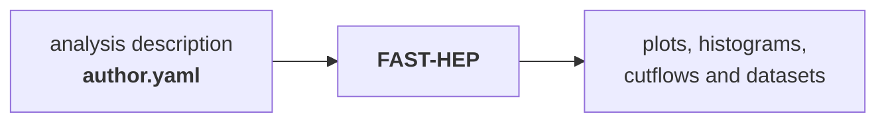
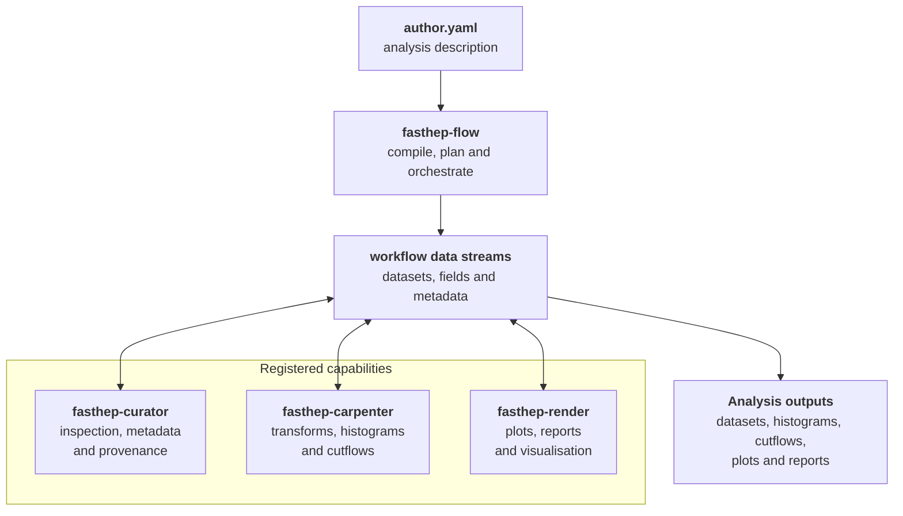

FAST-HEP is a toolkit for building declarative High Energy Physics (HEP) analyses.

Instead of encoding the entire analysis procedure in a Python program, users describe **what** they want to compute in a workflow. FAST-HEP turns this description into an executable analysis using specialised tools for data processing, metadata and provenance, and visualisation.



The workflow description provides a common representation of the analysis, making it easier to inspect, reproduce, validate, extend, and execute in different computing environments.


FAST-HEP is developed for HEP analysis, while several of its underlying components, including the workflow infrastructure, are designed to be domain-independent.


---

## Toolkit overview

FAST-HEP is built from focused packages that provide different parts of the analysis workflow. They share a common workflow description and can be extended through registries.



The packages are designed to remain focused: `fasthep-flow` provides the general workflow machinery, while other packages add capabilities for HEP analysis, data inspection, and visualisation.


**A note on naming:** `fasthep-flow` is referred to as **Flow** throughout this documentation. In Python, it is imported as `hepflow`.



---

## Packages

The FAST-HEP toolkit currently includes:

| Package | Purpose |
|---|---|
| `fasthep-flow` | Workflow description, compilation, planning, and execution |
| `fasthep-carpenter` | HEP analysis transforms, histogramming, and columnar data processing |
| `fasthep-curator` | Dataset inspection, metadata, provenance, and diagnostics |
| `fasthep-render` | Plotting, reports, and visualisation |
| `fasthep-cli` | Unified command-line interface |
| `fasthep-toolbench` | Shared, domain-independent utilities |
| `fasthep-workshop` | Tutorials, examples, and training material |
| `fasthep` | Meta-package for installing the FAST-HEP toolkit |
| `fasthep-dev` | Development and integration workspace |

---
## Installation

FAST-HEP packages are published independently and can also be installed through the `fasthep` meta-package.

```bash
pip install "fasthep[hep]"
```

For tutorials and reproducible example environments, the workshop material uses [Pixi](https://pixi.sh/).

For development across the full toolkit, see [`fasthep-dev`](https://github.com/FAST-HEP/fasthep-dev).

---

## Tutorials and examples

The [`fasthep-workshop`](https://fasthep-workshop.readthedocs.io/en/latest/) provides runnable tutorials and example analyses.

It covers the full path from basic columnar data processing to declarative workflows, custom transforms, rendering, scaling, and accelerator use.

For a first introduction to FAST-HEP, this is the best place to start.

---

## Documentation

Documentation is split according to purpose:

* **This site** — overview of the FAST-HEP toolkit, architecture, and project-level guides
* [`fasthep-flow`](https://fasthep-flow.readthedocs.io/en/latest/) — declarative workflow descriptions, compilation, planning, and execution
* [`fasthep-workshop`](https://fasthep-workshop.readthedocs.io/en/latest/) — tutorials, examples, and training material
* **Package documentation** — API references and package-specific details

---

## Contributing

FAST-HEP is developed openly on GitHub, and contributions are welcome across code, documentation, examples, testing, and infrastructure.

See the [contributing guide](https://github.com/FAST-HEP/fasthep/blob/main/CONTRIBUTING.md) for the development workflow and toolkit structure.

---

## Get started

New to FAST-HEP?

Start with the [Getting Started](/getting-started/) guide for a first walkthrough of the toolkit, from installation to running a small declarative analysis.
