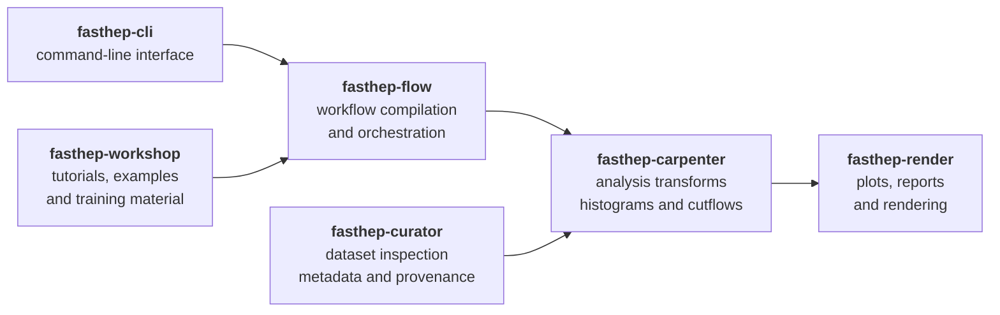

FAST-HEP is an ecosystem of modular tools for declarative High Energy Physics (HEP) workflows, analysis, rendering, metadata management, and reproducible scientific computing.

The project focuses on separating:

- workflow orchestration
- analysis logic
- metadata and provenance
- rendering and reporting
- experiment-specific extensions

This modular design enables analyses that are:

- easier to understand
- easier to reproduce
- easier to validate
- easier to extend
- easier to share across collaborations and experiments

FAST-HEP aims to provide modern analysis tooling built around:

- declarative workflows
- vectorised array programming
- reproducible environments
- explicit metadata and provenance
- composable package ecosystems
- experiment-independent infrastructure where practical

---

## Ecosystem overview

The FAST-HEP ecosystem is built from several focused packages that interact through shared workflow descriptions and extension registries.



---

## Packages

The current FAST-HEP ecosystem includes:

| Package | Purpose |
|---|---|
| `fasthep-flow` | Workflow compilation, planning, runtime orchestration |
| `fasthep-carpenter` | Analysis transforms, histogramming, awkward/ROOT processing |
| `fasthep-curator` | Dataset inspection, provenance, diagnostics, metadata |
| `fasthep-render` | Plotting, reports, rendering pipelines |
| `fasthep-cli` | Unified command-line interface |
| `fasthep-toolbench` | Shared utilities and lightweight tooling |
| `fasthep-workshop` | Tutorials, examples, and training material |
| `fasthep` | Meta package and compatibility bundle |
| `fasthep-dev` | Integration workspace and ecosystem validation |

---

## Installation

FAST-HEP packages are published independently and can also be installed through the `fasthep` meta package.

```bash
pip install "fasthep[hep]"
```

For ecosystem development and integration testing, see the `fasthep-dev` workspace.

---

## Design philosophy

FAST-HEP intentionally separates concerns between packages.

For example:

- `fasthep-flow` owns workflow semantics and orchestration
- `fasthep-carpenter` owns HEP analysis transforms
- `fasthep-curator` owns metadata and provenance
- `fasthep-render` owns visual output and reporting

This separation helps maintain:

- stable interfaces
- reusable tooling
- experiment-specific extensibility
- long-term maintainability

---

## Tutorials and examples

Runnable tutorials and example analyses are provided by:

- `fasthep-workshop`

These examples demonstrate:

- declarative workflows
- custom transforms
- profile and registry extensions
- rendering pipelines
- analysis repository structure

---

## Documentation structure

FAST-HEP documentation is split across several repositories:

- this site
  - ecosystem concepts, architecture, and guides

- package documentation
  - API and package-specific details

- `fasthep-workshop`
  - runnable tutorials and examples

---

## Contributing

FAST-HEP is developed openly on GitHub.

We welcome contributions including:

- bug reports
- documentation improvements
- examples and tutorials
- infrastructure improvements
- tests and validation
- AI-assisted contributions with appropriate review

See the contributing guide for development workflow and ecosystem structure details.

---

## Contents


