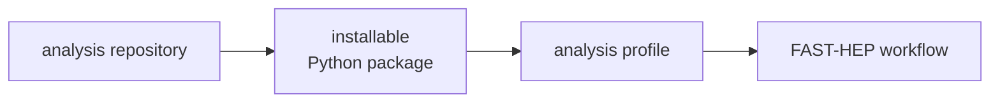
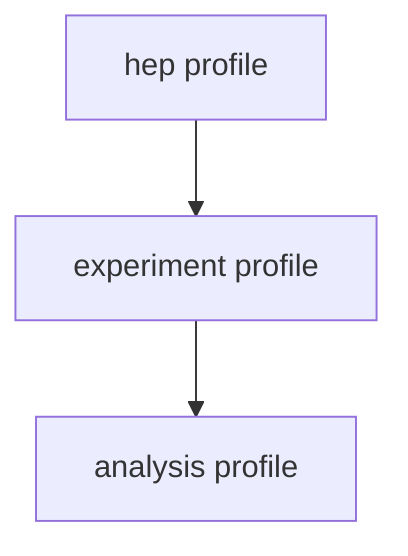

---

title: "Analysis repositories"
weight: 6
---

FAST-HEP encourages analyses to be structured as installable Python packages.

This provides a natural place for:

* workflow descriptions
* analysis-specific operations
* profiles and registries
* configuration
* tests
* documentation

and makes analysis code identifiable as a versioned software component.



This is particularly important for reproducibility: analysis-specific code is part of the software environment that produced a scientific result.

---

## Recommended structure

A FAST-HEP analysis might use a structure such as:

```text
my-analysis/
├── author.yaml
├── pyproject.toml
├── README.md
├── src/
│   └── my_analysis/
│       ├── profiles/
│       │   └── registry.yaml
│       ├── operations/
│       └── __init__.py
└── tests/
```

The exact structure is not prescribed. An analysis only needs the components relevant to it.

The important recommendation is that analysis-specific Python code lives in an **installable package** rather than relying on scripts or directories added manually to `PYTHONPATH`.

The package can be installed normally with tools such as `pip` or `pixi`, including as an editable installation during development.

---

## Analysis-specific capabilities

Many analyses need functionality beyond the operations provided by the standard FAST-HEP toolkit.

For example, an analysis may provide:

* experiment-specific calculations
* specialised object definitions or selections
* custom data readers
* alternative implementations of existing operations
* specialised output handling
* additional diagnostics

These capabilities can use the same registry and profile mechanisms as the rest of FAST-HEP.



An analysis can therefore extend an existing environment rather than modifying Flow or the FAST-HEP packages that it depends on.

See [Profiles and registries]() for how these environments are composed.

---

## Why installable packages?

Python allows code to be made importable simply by manipulating `PYTHONPATH`. This is common in existing analysis environments, but provides little information about where that code came from or which version was used.

Installing analysis code as a package gives it a clearer identity within the software environment.

This makes it easier to:

* declare and reproduce dependencies
* identify analysis-specific software
* record package versions
* test code independently
* use standard Python development tooling
* share the analysis with collaborators

For FAST-HEP, this also supports provenance.

As workflow capabilities are resolved, FAST-HEP can associate implementations with the packages that provided them. Recording those package identities and versions can then help reconstruct the software environment used for a particular execution.

Support for collecting this information automatically as part of FAST-HEP provenance is under development.

---

## Reproducibility

A reproducible analysis requires more than preserving its `author.yaml`.

The workflow may refer to operations provided by:

```text
FAST-HEP packages
        +
experiment packages
        +
analysis package
```

Together, these form part of the executable scientific environment.

Packaging analysis-specific code makes those dependencies explicit and gives provenance tooling something concrete to identify and record.

This complements the FAST-HEP architecture described in the preceding concept pages: implementations are deliberately replaceable, so reproducibility requires knowing **which implementations were actually used**.

---

## Testing and development

Treating an analysis as a software package also makes conventional software-engineering practices easier to adopt.

Analysis repositories can include:

* unit tests for analysis-specific operations
* workflow smoke tests
* regression tests for scientific outputs
* integration tests
* documentation and examples

None of these require special FAST-HEP mechanisms; standard Python tooling can be used alongside the workflow.

---

## Examples and guidance

The [`fasthep-workshop`](https://github.com/FAST-HEP/fasthep-workshop) repository contains runnable analyses and examples of FAST-HEP project organisation.

The recommended repository structure will continue to evolve as FAST-HEP tooling and provenance support mature.

The aim is not to impose a rigid directory layout, but to make analysis-specific software **installable, identifiable, testable, and reproducible**.

---

## Related concepts

* [Workflow language]()
* [Compilation and execution]()
* [Operations and specs]()
* [Profiles and registries]()
* [Execution environments]()
