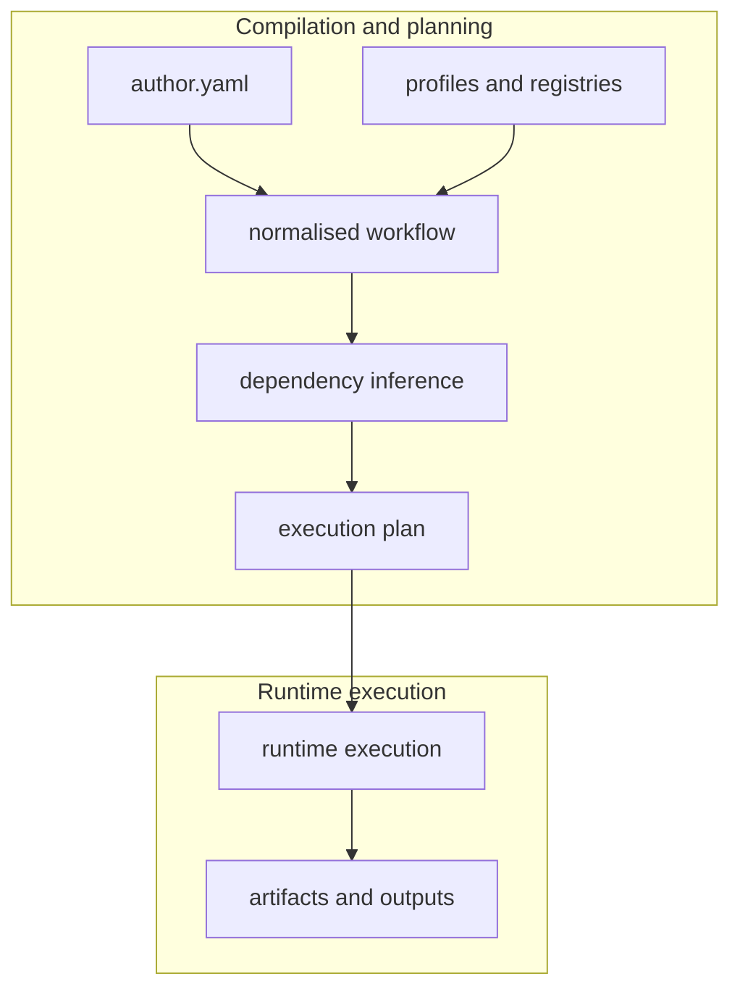

FAST-HEP workflows are not executed directly from the raw `author.yaml` file.

Instead, workflows pass through several compilation stages before runtime execution begins.

This pipeline allows FAST-HEP to:

- validate workflows
- infer dependencies
- resolve profiles and extensions
- construct execution graphs
- optimise execution order
- generate diagnostics and provenance artifacts
- separate workflow semantics from runtime execution

The compilation pipeline is one of the core architectural ideas behind FAST-HEP.

---

## Overview



The main boundary is between the execution plan and runtime execution: FAST-HEP can validate, normalise, resolve profiles, and infer dependencies before any data processing starts.

---

## Stage 1: Author workflow

The author workflow is the user-facing declarative YAML.

Example:

```yaml
analysis:
  stages:
    - id: BasicVars
      op: hep.define
      params:
        variables:
          - name: Muon_Pt
            expr: "sqrt(Muon_Px ** 2 + Muon_Py ** 2)"
```

At this stage, the workflow is:

- compact
- human-oriented
- partially implicit
- profile-dependent

For example, operation implementations are not yet resolved directly. The workflow only references operation kinds such as:

```yaml
op: hep.define
```

---

## Stage 2: Profile resolution

Profiles extend the workflow language.

Example:

```yaml
use:
  profiles:
    - fasthep_carpenter:registry
    - fasthep_render:registry
```

During profile resolution, FAST-HEP loads:

- operation registrations
- source implementations
- renderers
- hooks
- sinks
- diagnostics extensions

This step determines which implementations are available to the workflow.

---

## Stage 3: Normalisation

The workflow is then converted into a normalised representation.

Normalisation expands implicit structures into a more explicit intermediate form.

Typical normalisation tasks include:

- resolving inherited styles
- expanding shorthand forms
- validating schema structure
- attaching defaults
- resolving references
- lowering convenience syntax
- expanding render declarations
- resolving operation specifications

The resulting workflow is easier for later planning stages to reason about.

The normalised representation is generally intended for machines and debugging tools rather than direct authoring.

---

## Stage 4: Dependency inference

FAST-HEP then analyses the workflow graph.

Operations declare or infer:

- required inputs
- produced outputs
- stream dependencies
- aggregation boundaries

Example:

```yaml
expr: "sqrt(Muon_Px ** 2 + Muon_Py ** 2)"
```

allows FAST-HEP to infer dependencies on:

```text
Muon_Px
Muon_Py
```

and determine that the operation produces:

```text
Muon_Pt
```

This dependency graph helps determine:

- execution ordering
- required data reads
- partition boundaries
- aggregation stages
- rendering dependencies

---

## Stage 5: Planning

The planner lowers the workflow into an executable plan.

The plan contains more explicit execution details such as:

- operation ordering
- runtime phases
- partition execution
- aggregation steps
- render scheduling
- hook execution points
- artifact generation

At this stage, the workflow has become significantly more runtime-oriented.

---

## Stage 6: Runtime execution

The runtime executes the generated plan.

The execution backend may vary:

- local execution
- distributed execution
- future GPU-enabled execution
- future batch/grid execution

Importantly, the author workflow itself does not usually need to change when switching execution backends.

---

## Artifacts and debugging

FAST-HEP intentionally exposes intermediate artifacts where practical.

These may include:

- normalised workflows
- execution plans
- schema snapshots
- runtime diagnostics
- provenance summaries
- render specifications

This improves:

- debugging
- reproducibility
- workflow inspection
- validation
- long-term maintainability

---

## Why separate authoring from execution?

Traditional analysis code often mixes:

- physics logic
- execution logic
- orchestration
- rendering
- diagnostics

FAST-HEP attempts to separate these concerns.

The author workflow describes:

```text
what the analysis means
```

The planner and runtime determine:

```text
how the analysis executes
```

This separation helps make workflows:

- more portable
- easier to inspect
- easier to validate
- easier to extend
- less tightly coupled to specific runtimes

---

## Related concepts

- [Workflow language]()
- [Operations and specs]()
- [Profiles and registries]()
- [Execution backends]()
- [Analysis repositories]()
