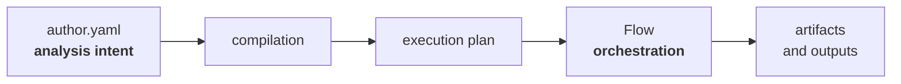
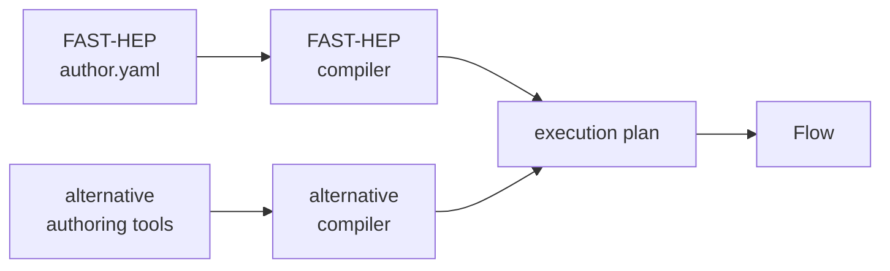

---

title: "Compilation and execution"
weight: 2
---

FAST-HEP separates the description of an analysis from its execution.

The standard FAST-HEP workflow starts with an `author.yaml` file, which is compiled into an explicit execution plan before scientific data are processed.



The **execution plan** forms an important boundary in the architecture.

Everything before it is concerned with understanding and compiling the analysis description. Everything after it is concerned with orchestrating the operations described by that plan.

---

## Compilation

The author description is designed primarily for scientists. It can be concise, use convenient authoring constructs, and refer to operations by their registered names.

During compilation, FAST-HEP progressively turns this description into a more explicit representation of the workflow.

This includes tasks such as:

* validating and normalising the description
* resolving available capabilities
* determining dependencies between operations
* constructing the workflow graph
* producing an executable plan

These steps happen before the analysis data are processed.

The intermediate representations can also be inspected, which helps with validation and debugging.

The precise compilation stages and intermediate representations are documented by [`fasthep-flow`](https://fasthep-flow.readthedocs.io/en/latest/).

---

## The execution plan

The execution plan describes the operations that need to run and how they relate to one another.

Flow consumes this plan and orchestrates its execution.

Crucially, Flow does not require the plan to have originated from the standard FAST-HEP author language:



This means alternative authoring interfaces, workflow generators, or compilation tools can use Flow without adopting `author.yaml`, provided they produce a compatible execution plan.

---

## Runtime execution

At runtime, Flow orchestrates the operations represented by the plan.

The execution system is deliberately separated from the scientific implementations themselves. Flow coordinates operations through defined contracts rather than owning the code that reads, transforms, or writes scientific data.

This allows both the **operations** and the **execution environment** to evolve independently of the authoring layer.

For example, the same analysis description can potentially be executed using different computing resources without encoding those details into the scientific workflow.

See [Execution environments]() for more about this separation.

---

## Inspecting the compilation

FAST-HEP exposes its compiled representations rather than treating compilation as a hidden implementation detail.

The [Getting started]() example produces, among other outputs:

```text
compile/
├── normalized.yaml
├── deps.yaml
├── plan.yaml
└── ...

graph/
├── graph.svg
├── graph.json
└── ...
```

These artifacts allow users and tools to inspect what FAST-HEP understood from the original analysis description and what it planned to execute.

For most users, understanding the individual compiler representations is not necessary. They are available when deeper inspection, debugging, validation, or tooling requires them.

---

## Learn more

This page describes why FAST-HEP separates compilation from execution.

For the technical specification of the compiler, intermediate representations, planning process, and runtime, see the [`fasthep-flow` documentation](https://fasthep-flow.readthedocs.io/en/latest/).

### Related concepts

* [Workflow language]()
* [Operations and specs]()
* [Profiles and registries]()
* [Execution environments]()
