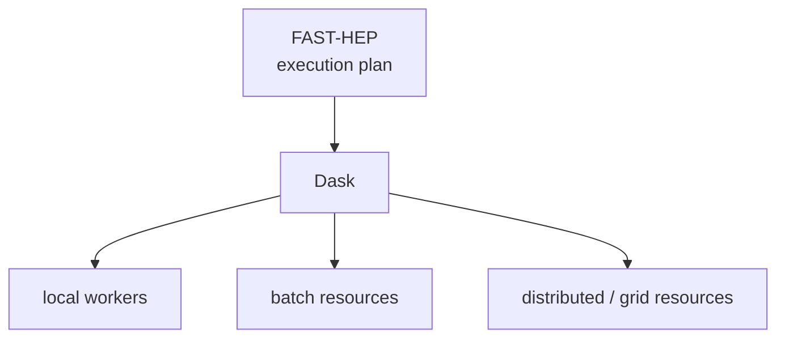

---

title: "Execution environments"
weight: 5
---------

FAST-HEP separates the scientific description of an analysis from the environment in which it executes.

The workflow describes **what should be computed**. The execution layer determines **how and where that computation runs**.

This separation allows the same analysis to move between execution environments without encoding scheduling or infrastructure details into the scientific workflow.

---

## Execution as a replaceable capability

Flow orchestrates the operations in an execution plan, but does not require them to run in one particular computing environment.

Execution may differ in how work is:

* partitioned
* scheduled
* distributed
* assigned to computing resources
* prepared for specialised hardware

The current FAST-HEP implementation supports local execution and Dask-based distributed execution.

The execution interfaces are designed so that additional environments can be integrated without changing the meaning of the analysis workflow.

---

## Distributed execution

For distributed analyses, FAST-HEP uses Dask to execute work across multiple workers.

The workers themselves may be provided by different computing infrastructures:

This provides another separation: the analysis does not need to know how the workers used to execute it were provisioned.

Support for additional distributed computing environments is under active development.

---

## Specialised execution

Some execution behaviour is provided through the same extension mechanisms used elsewhere in FAST-HEP.

For example, execution modifiers can prepare operations or workers for specialised execution environments such as GPUs.

This means that changing computing hardware does not necessarily require a different scientific operation or workflow description.

Instead, implementations and execution behaviour can be selected or extended while preserving the operation contracts understood by Flow.

This is another consequence of the FAST-HEP principle that the components underneath a workflow should remain replaceable.

---

## Portability and reproducibility

Separating workflow semantics from execution makes analyses more portable, but execution choices can still affect how a workflow was run.

FAST-HEP therefore treats execution information as part of the wider provenance of an analysis.

Recording information about the resolved operations, software environment, execution configuration, and computing resources is important for reproducing and debugging workflow executions.

Provenance support for some of this information is still under development.

---

## Learn more

This page describes the role of execution environments in the FAST-HEP architecture.

For the current execution interfaces, Dask integration, runtime configuration, and backend-specific options, see the [`fasthep-flow` documentation](https://fasthep-flow.readthedocs.io/en/latest/).

### Related concepts

* [Workflow language]()
* [Compilation and execution]()
* [Operations and specs]()
* [Profiles and registries]()
* [Analysis repositories]()
