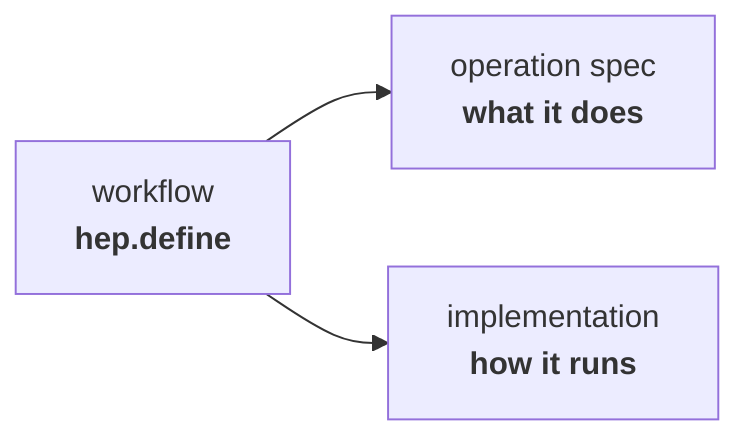
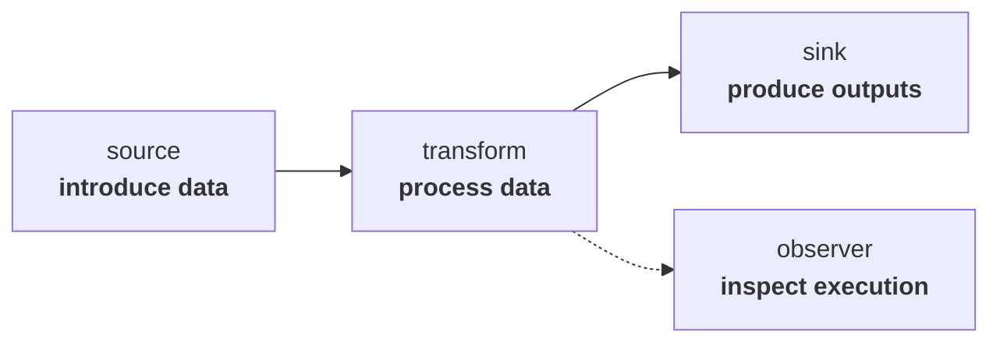
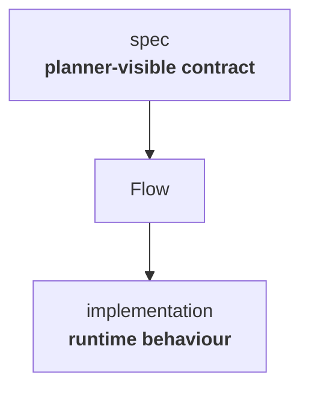

---

title: "Operations and specs"
weight: 3
---

Operations are the units of work that Flow orchestrates.

They may read data, transform it, inspect it, or produce outputs. FAST-HEP provides many operations for common HEP tasks, but operations are deliberately replaceable and can also be supplied by experiments, projects, or individual analyses.

The workflow refers to an operation by name, while Flow resolves the implementation separately.

This separation is central to FAST-HEP: the workflow describes the scientific intent without being tied to one particular implementation.

---

## Operation roles

At the workflow level, operations have a small number of broad roles.

For example, an operation might:

* read events from a ROOT file
* derive a new quantity
* apply a selection
* fill a histogram
* inspect schema or provenance information
* write a dataset
* render a plot

The precise operation catalogue belongs to the packages that provide those capabilities rather than to Flow itself.

---

## Specs

Each operation exposes a specification, or **spec**, describing the parts of its behaviour that Flow needs to understand.

A spec can describe things such as:

* the inputs an operation expects
* the products it creates
* how those products move through the workflow
* constraints relevant to planning and validation
* configuration accepted by the operation

The runtime implementation remains responsible for performing the actual computation.

Because the spec is separate from the implementation, Flow can reason about an analysis before processing scientific data.

This supports dependency analysis, validation, workflow inspection, and execution planning without requiring Flow to know the internal details of the operation.

---

## Replaceable implementations

The same workflow-level capability does not have to be permanently tied to a single implementation.

An operation can be replaced or reimplemented as long as it satisfies the contract expected by Flow.

This allows implementations to evolve independently as:

* software libraries change
* data formats change
* new algorithms become available
* different experiments require specialised behaviour
* workloads move between CPUs, GPUs, or other computing resources

The orchestration layer therefore does not need to own the scientific data-processing implementation.

This replaceability is one of the main architectural principles of FAST-HEP.

---

## How operations become available

Operations are made available to workflows through registries, which associate workflow-visible names with their specifications and runtime implementations.

Profiles then compose registries and other configuration into reusable environments for particular use cases.

For example, a HEP profile can make HEP analysis, rendering, metadata, and provenance capabilities available together without those capabilities becoming part of Flow itself.

See [Profiles and registries]() for an overview of how this composition works.

---

## Learn more

This page describes the role of operations and specs in the FAST-HEP architecture.

For the current operation contract, spec format, product handling, runtime interfaces, and implementation details, see the [`fasthep-flow` documentation](https://fasthep-flow.readthedocs.io/en/latest/).

### Related concepts

* [Workflow language]()
* [Compilation and execution]()
* [Profiles and registries]()
* [Execution environments]()
