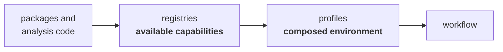
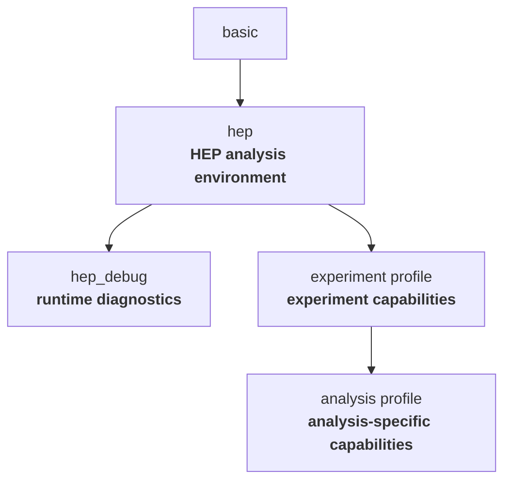
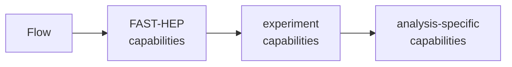

---

title: "Profiles and registries"
weight: 4
---

FAST-HEP keeps capabilities separate from the workflow engine.

**Registries** tell Flow which capabilities are available and how to resolve them.

**Profiles** compose those capabilities and other configuration into reusable workflow environments.



Together, these mechanisms allow FAST-HEP to provide useful defaults while keeping individual capabilities replaceable and independently extensible.

---

## Registries

A registry is a catalogue of capabilities available to Flow.

The [`fasthep-carpenter` registry](https://github.com/FAST-HEP/fasthep-carpenter/blob/main/src/fasthep_carpenter/profiles/registry.yaml), for example, provides sources, analysis transforms, sinks, execution modifiers, product handling, and expression functions.

For operations, a registry associates a workflow-visible name with its specification and runtime implementation:

```text
hep.define
    │
    ├── spec
    │     describes the operation contract
    │
    └── implementation
          performs the computation
```

The real Carpenter registry contains entries such as `hep.define`, `hep.hist`, and `hep.di_object_mass`, alongside capabilities for ROOT I/O, GPU execution modifiers, product handling, and expression functions.

This is how Flow can orchestrate capabilities supplied by other packages while remaining independent of their internal implementation.

---

## Profiles and composition

Profiles provide reusable combinations of capabilities and configuration.

For example, the [`hep` profile](https://github.com/FAST-HEP/fasthep-flow/blob/main/src/hepflow/profiles/hep.yaml) combines the capabilities needed for a typical HEP analysis, while the [`hep_debug` profile](https://github.com/FAST-HEP/fasthep-flow/blob/main/src/hepflow/profiles/hep_debug.yaml) builds on it by adding runtime diagnostics.

Profiles can include other profiles, allowing environments to be built through composition:



A workflow can therefore request a useful environment without needing to know which individual packages and registries provide every capability.

The same composition mechanism is available to experiments and individual analyses. They can add new capabilities or replace existing implementations while continuing to build on the standard FAST-HEP environment.

This allows customisation through composition rather than by modifying Flow or FAST-HEP packages directly.


**Provenance and reproducibility:** FAST-HEP is being extended to record the resolved workflow capabilities, their implementations, and the versions of the packages that provided them as part of the workflow provenance.

This will make it possible to determine not only what an analysis requested, but also which concrete software components were used to execute it. This information is important for reproducibility and for diagnosing differences between workflow executions.

This provenance support is currently under development.



---

## Extending FAST-HEP

Registries and profiles are not limited to packages maintained by FAST-HEP.

Experiments, projects, and individual analyses can provide their own capabilities using the same interfaces as the standard toolkit.

For example, an extension package might provide:

* experiment-specific data readers
* specialised analysis operations
* alternative implementations of existing operations
* GPU-oriented runtime behaviour
* custom product handling
* additional diagnostics

Those capabilities can then be composed with existing FAST-HEP profiles.



Flow does not need to distinguish between a capability supplied by FAST-HEP and one supplied by an external package. What matters is that it satisfies the relevant contract.

---

## Why this matters

Profiles and registries make extensibility part of the FAST-HEP architecture rather than an additional plugin mechanism layered on top of it.

Flow provides the orchestration, while the capabilities that interact with scientific data can come from FAST-HEP, experiments, external projects, or individual analyses.

Combined with the operation contracts described in [Operations and specs](), this allows implementations to evolve or be replaced without requiring the workflow engine itself to understand their internal details.

---

## Learn more

This page describes the role of profiles and registries in the FAST-HEP architecture.

For the current profile format, registry schema, composition rules, resource discovery, overrides, and extension interfaces, see the [`fasthep-flow` documentation](https://fasthep-flow.readthedocs.io/en/latest/).

### Related concepts

* [Workflow language]()
* [Compilation and execution]()
* [Operations and specs]()
* [Execution environments]()
* [Analysis repositories]()
