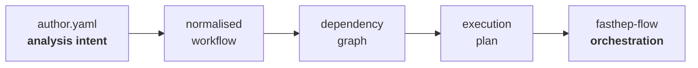
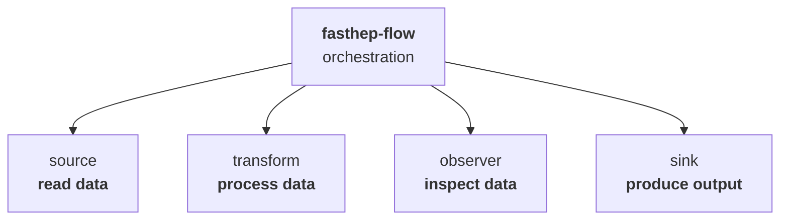

---

title: "Workflow language"
weight: 1
---------

FAST-HEP analyses are typically described declaratively using an `author.yaml` file.

The author description captures **what data are available and what should be computed from them**, without requiring the user to prescribe every detail of execution.

`fasthep-flow` turns this description into an explicit execution plan:

This separates three concerns:

* **authoring** — how scientists describe an analysis
* **compilation** — how that description becomes an executable plan
* **orchestration** — how the plan is executed

For most users, these layers work together transparently. Their separation allows each to evolve independently.

The standard FAST-HEP author language and compiler are not required by the runtime: other tools can construct compatible execution plans and use `fasthep-flow` to execute them directly.

---

## Describing an analysis

An author workflow brings together the information needed to describe an analysis, such as:

* datasets and data sources
* derived quantities and selections
* analysis operations
* histograms and other data products
* rendering and reporting
* metadata and provenance

The description does not need to prescribe how every operation is executed.

For example, an analysis can request that a quantity is calculated from several input fields without specifying how events are partitioned, scheduled, or processed by the underlying execution system.

This allows the scientific description of an analysis to remain relatively independent of its execution environment.

---

## Composable operations

FAST-HEP is built around **replaceable operations with explicit contracts**.

`fasthep-flow` connects and orchestrates these operations, while the operations themselves provide the capabilities that read, transform, inspect, render, or write data.

FAST-HEP provides implementations for common use cases:

* `fasthep-carpenter` provides HEP-oriented data processing operations
* `fasthep-curator` provides inspection, metadata, and provenance capabilities
* `fasthep-render` provides plotting and reporting operations

These implementations are not intrinsic to the workflow engine. Projects, experiments, or individual analyses can replace them or provide entirely new operations.

As long as an operation satisfies the relevant workflow contract, Flow can orchestrate it without needing to understand its internal implementation.

**Everything that interacts with scientific data can therefore evolve independently of the orchestration layer.** Implementations can change as requirements, data formats, software libraries, or computing hardware change without redesigning the workflow engine.

The operation contracts and registration mechanisms are described in detail in the [fasthep-flow documentation](https://fasthep-flow.readthedocs.io/en/latest/).

---

## Inspectable workflows

Compilation gives FAST-HEP an explicit representation of the analysis before it is executed.

This makes it possible to inspect:

* which operations will run
* what each operation depends on
* how data flow between operations
* what outputs will be produced
* which capabilities the analysis requires

These representations support validation, debugging, provenance, visualisation, and alternative execution environments.

The workflow graph generated in the [Getting started]() example is one representation of this compiled analysis structure.

For an overview of the individual compilation stages, see [Compilation and Execution]().

---

## Execution

The execution plan is also separated from the system that runs it.

An analysis should not generally need to change simply because it moves from a local machine to a distributed computing environment or different computing hardware.

Execution environments determine how the compiled plan is run, while the workflow continues to describe the scientific computation.

See [Execution environments]() for an overview.

---

## Learn more

This page describes the role of the workflow language within FAST-HEP rather than its complete syntax.

For the current language specification, operation contracts, profiles, and detailed technical documentation, see the [fasthep-flow documentation](https://fasthep-flow.readthedocs.io/en/latest/).

For runnable analyses and guided tutorials, see the [FAST-HEP workshop](https://fasthep-workshop.readthedocs.io/en/latest/).

### Related concepts

* [Compilation and execution]()
* [Operations and specs]()
* [Profiles and registries]()
* [Execution environments]()
* [Analysis repositories]()
