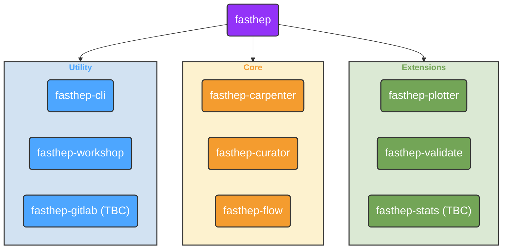

+++
weight = 1
+++

To ensure production workflows remain stable and uninterrupted—while also improving consistency and visibility across the ecosystem—all fast-* packages will undergo a planned restructure and renaming process.

### Renaming and Consolidation

- All `fast-*` packages will be renamed to follow the `fasthep-*` naming convention.
- `scikit-validate` will become `fasthep-validate`.
- Three new packages will be introduced:
  - **`fasthep-cli`**: A unified command-line interface replacing the individual CLIs in existing `fast-*` packages.
  - **`fasthep-workshop`**: A curated set of Jupyter notebooks demonstrating real-world usage in a workshop-style format.
  - **`fasthep`**: A meta-package simplifying installation of the entire FAST-HEP stack — or subsets of it.

An overview of the planned packages is shown below:

Not all of these packages exist at the moment, for details check the status below.

### fasthep

| Package | Description | Installation | Status |
| --- | --- |--- |--- |
| **fasthep** | Metapackage for all FAST-HEP packages for easier installation | `pip install fasthep[full\|core\|dev]` | :yellow_circle: Ready for testing |
| **fasthep-cli** |  Unified Command Line Interface for all FAST-HEP packages | ``pip install fasthep-cli`` | :yellow_circle: Ready for testing |
| **fasthep-logging** | Logging package - provides "trace" and "timing" log-levels | ``pip install fasthep-logging`` |:green_circle: Completed |
| **fasthep-gitlab** | Refactor of gitlab components from scikit-validate | `pip install fasthep-gitlab` | :red_circle: None |
| **fasthep-carpenter** | Rewrite of fast-carpenter | `pip install fasthep-carpenter` | :orange_circle: In Development |
| **fasthep-curator** | Clone of fast-curator. | `pip install fasthep-curator` | :yellow_circle: Ready for testing |
| **fasthep-flow** | Clone of fast-flow. | `pip install fasthep-flow` | :orange_circle: In Development |
| **fasthep-plotter** | Rewrite of fast-plotter |`pip install fasthep-plotter` | :red_circle: None |
| **fasthep-toolbench** | Package for cross-package utility functions |`pip install fasthep-toolbench` | :red_circle: None |
| **fasthep-validate** | Rewrite of scikit-validate | `pip install fasthep-validate` | :red_circle: None |
| **fasthep-stats** |Rewrite of fast-datacard?? | `pip install fasthep-stats` | :red_circle: None |

