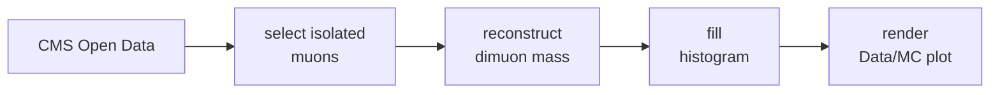
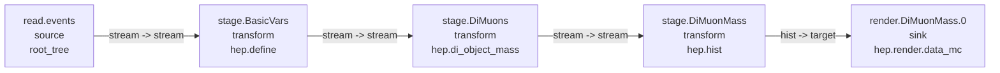

---

title: "Getting started"
---

This guide walks through a small FAST-HEP analysis using CMS Open Data.

FAST-HEP analyses are described declaratively: you describe **what** you want to compute, while FAST-HEP determines how the corresponding workflow should be constructed and executed.

By the end of this guide, you will have:

* set up a reproducible FAST-HEP environment
* run a dimuon analysis using CMS Open Data
* produced a Data/MC comparison of the dimuon invariant mass
* seen how the analysis is described in `author.yaml`


FAST-HEP is currently undergoing a major rewrite and is in alpha development.

Interfaces and installation details may change while the toolkit stabilises.


---

## Get the example

The quickest way to try FAST-HEP is through the runnable examples in the workshop repository.

Clone the repository:

```bash
git clone https://github.com/FAST-HEP/fasthep-workshop.git
cd fasthep-workshop
```

The workshop uses [Pixi](https://pixi.sh/) to provide a reproducible environment containing the required FAST-HEP packages and dependencies.

Set up the environment with:

```bash
pixi install
```


If you want to install FAST-HEP into an existing Python environment instead, see the [installation guide](/#installation).


---

## The dimuon example

We will use the CMS Open Data dimuon example:

```text
examples/CMS/Zmumu/
├── author.yaml
└── remote_data.json
```

The analysis compares CMS collision data with simulated Standard Model processes around the Z boson resonance.

It reads muon information from ROOT files, identifies isolated muons, reconstructs the dimuon invariant mass, fills a histogram, and produces a Data/MC comparison.



The complete analysis is described by [`author.yaml`](https://github.com/FAST-HEP/fasthep-workshop/blob/main/examples/CMS/Zmumu/author.yaml).

---

## Get the data

The example data files are not stored directly in the repository. Their remote locations are described by `examples/CMS/Zmumu/remote_data.json`.

Download them with:
```bash
pixi run fasthep download --json examples/CMS/Zmumu/remote_data.json -d data/
```

The files will be placed under `data/` using the paths expected by the example workflow.

---

## Run the analysis

Run the dimuon workflow with:

```bash
pixi run fasthep run examples/CMS/Zmumu/author.yaml \
    --outdir build/examples/Zmumu
```

FAST-HEP reads the analysis description, compiles it into an execution plan, runs the configured datasets, and writes the results and supporting workflow information to the output directory.

---

## Inspect the result

The final Data/MC plot is written to:

```text
build/examples/Zmumu/artifacts/plots/DiMuonMass.png
```

It shows the reconstructed dimuon invariant-mass distribution, including the characteristic Z boson peak around 90 GeV.

FAST-HEP also writes the compiled workflow graph:

```text
build/examples/Zmumu/graph/graph.svg
```

For this analysis, the graph is approximately:



This is the executable structure inferred from the declarative analysis description: read the event stream, derive the required variables, reconstruct the dimuon mass, fill the histogram, and render the result.

---

## What else was produced?

The output directory contains more than the final plot:

```text
build/examples/Zmumu/
├── artifacts/    # analysis products
├── compile/      # normalised workflow and execution plan
├── graph/        # workflow graph in several formats
├── render/       # rendering specifications
├── reports/      # diagnostics and provenance reports
└── run_summary.yaml
```

The `artifacts/` directory contains user-facing analysis outputs such as plots, histograms, cutflows, tables, and provenance records.

The `compile/` and `graph/` directories expose how FAST-HEP interpreted and planned the workflow. These are particularly useful for inspecting, debugging, and validating an analysis.

For a first run, the two most useful files are:

```text
artifacts/plots/DiMuonMass.png
graph/graph.svg
```

---

## Where next?

You have now run a complete FAST-HEP analysis and seen both its scientific output and the workflow FAST-HEP constructed from its description.

Where to go next depends on what you want to explore:

* **Build more realistic analyses:** continue with the [FAST-HEP workshop](https://fasthep-workshop.readthedocs.io/en/latest/) for guided tutorials and runnable examples.
* **Understand the workflow language:** read about [Workflow language]() or explore the [fasthep-flow documentation](https://fasthep-flow.readthedocs.io/en/latest/) for the full workflow model, compilation, planning, and execution.
* **Structure your own analysis:** see [Analysis repositories]().
* **Explore the toolkit:** see [Packages]() for the components that make up FAST-HEP.

