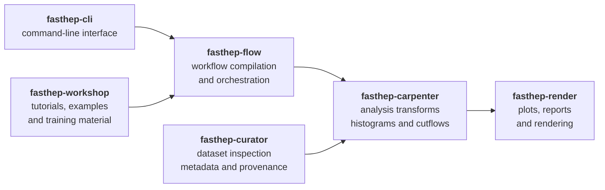

The FAST-HEP ecosystem is split into focused packages.

Each package owns a small part of the workflow stack and exposes functionality through public APIs, profiles, registries, or command-line tools.



## Overview

| Package | Purpose | Documentation | Git Repo | 
|---|---|---|---|
| `fasthep-flow` | Workflow compilation, planning, runtime orchestration | [API docs](https://fasthep-flow.readthedocs.io/en/latest/) | [FAST-HEP/fasthep-flow](https://github.com/FAST-HEP/fasthep-flow) |
| `fasthep-carpenter` | Analysis transforms, histogramming, awkward/ROOT processing | [API docs](https://fasthep-carpenter.readthedocs.io/en/latest/) | [FAST-HEP/fasthep-carpenter](https://github.com/FAST-HEP/fasthep-carpenter) |
| `fasthep-curator` | Dataset inspection, provenance, diagnostics, metadata | [API docs](https://fasthep-curator.readthedocs.io/en/latest/) | [FAST-HEP/fasthep-curator](https://github.com/FAST-HEP/fasthep-curator) |
| `fasthep-render` | Plotting, reports, rendering pipelines | [API docs](https://fasthep-render.readthedocs.io/en/latest/) | [FAST-HEP/fasthep-render](https://github.com/FAST-HEP/fasthep-render) |
| `fasthep-cli` | Unified command-line interface | [API docs](https://fasthep-cli.readthedocs.io/en/latest/) |  [FAST-HEP/fasthep-cli](https://github.com/FAST-HEP/fasthep-cli) |
| `fasthep-toolbench` | Shared utilities and lightweight tooling | [API docs](https://fasthep-toolbench.readthedocs.io/en/latest/)  |  [FAST-HEP/fasthep-toolbench](https://github.com/FAST-HEP/fasthep-toolbench) |
| `fasthep-workshop` | Tutorials, examples, and training material | --- | [FAST-HEP/fasthep-workshop](https://github.com/FAST-HEP/fasthep-workshop) |
| `fasthep` | Meta package and compatibility bundle | --- | [FAST-HEP/fasthep](https://github.com/FAST-HEP/fasthep) |
| `fasthep-dev` | Integration workspace and ecosystem validation | --- | [FAST-HEP/fasthep-dev](https://github.com/FAST-HEP/fasthep-dev) |

---

## `fasthep-flow`

`fasthep-flow` provides the core work**flow** engine. It is the package responsible for turning declarative workflow descriptions into executable plans.

It owns:

- workflow compilation
- normalisation
- execution planning
- runtime orchestration
- registry/profile loading
- backend interfaces


Full documentation:

- [fasthep-flow API docs](https://fasthep-flow.readthedocs.io/en/latest/)
- [GitHub repository](https://github.com/FAST-HEP/fasthep-flow)


Despite the `hep` in the package name, `fasthep-flow` aims to remain largely HEP agnostic. The workflow compilation and orchestration layers are intentionally separated from experiment-specific analysis logic where practical.


---

## `fasthep-carpenter`

`fasthep-carpenter` provides common HEP analysis building blocks.

It owns:

- analysis transforms
- ROOT/awkward data handling
- histogram filling
- cutflows
- object reconstruction helpers
- output writers

The name comes from the original idea of turning ROOT **trees** into **table**-like analysis products.

Full documentation:

- [fasthep-carpenter API docs](https://fasthep-carpenter.readthedocs.io/en/latest/)
- [GitHub repository](https://github.com/FAST-HEP/fasthep-carpenter)

---

## `fasthep-curator`

`fasthep-curator` provides dataset and metadata tooling.

It owns:

- dataset inspection
- schema snapshots
- provenance capture
- diagnostics
- validation helpers
- runtime reporting hooks

The name reflects its role as a curator of metadata, provenance, and diagnostic information around workflows.

Full documentation:

- [fasthep-curator API docs](https://fasthep-curator.readthedocs.io/en/latest/)
- [GitHub repository](https://github.com/FAST-HEP/fasthep-curator)

---

## `fasthep-render`

`fasthep-render` provides visual and report output.

It owns:

- plots
- tables
- reports
- render styles
- rendering sinks
- publication-oriented visual outputs

Full documentation:

- [fasthep-render API docs](https://fasthep-render.readthedocs.io/en/latest/)
- [GitHub repository](https://github.com/FAST-HEP/fasthep-render)

---

## `fasthep-cli`

`fasthep-cli` provides the unified `fasthep` command-line interface.

It owns:

- user-facing commands
- workflow command dispatch
- package/version inspection
- example downloads
- CLI output formatting

The CLI is intentionally thin. It should call public APIs from the owning packages rather than duplicating implementation logic.

Full documentation:

- [fasthep-cli API docs](https://fasthep-cli.readthedocs.io/en/latest/)
- [GitHub repository](https://github.com/FAST-HEP/fasthep-cli)

---

## `fasthep-toolbench`

`fasthep-toolbench` provides shared utilities used by other FAST-HEP packages.

It owns lightweight helpers for:

- display (terminal)
- downloads
- package discovery
- user-facing utility functions

It should remain small and should not contain workflow, analysis, rendering, or metadata ownership logic.

Repository:

- [GitHub repository](https://github.com/FAST-HEP/fasthep-toolbench)

---

## `fasthep-workshop`

`fasthep-workshop` contains tutorials, examples, and training material.

It is also intended to act as a reference analysis-style repository, showing how an analysis can provide:

- profiles
- registries
- custom sources
- custom transforms
- runnable examples

Repository:

- [GitHub repository](https://github.com/FAST-HEP/fasthep-workshop)

---

## `fasthep`

`fasthep` is the meta package.

It provides curated installation profiles and, in future, verified compatibility bundles across the FAST-HEP ecosystem.

Typical installation:

```bash
pip install "fasthep[hep]"
```

Repository:

- [GitHub repository](https://github.com/FAST-HEP/fasthep)

---

## `fasthep-dev`

`fasthep-dev` is the integration workspace.

It is not an installable Python package. It collects FAST-HEP repositories as Git submodules and provides shared tooling for:

- cross-package development
- smoke testing
- release validation
- package coordination
- AI/developer navigation

Repository:

- [GitHub repository](https://github.com/FAST-HEP/fasthep-dev)

---

## Package boundaries

The package split is intentional.

As a rule of thumb:

- workflow semantics belong in `fasthep-flow`
- HEP transforms and ROOT/awkward handling belong in `fasthep-carpenter`
- metadata and diagnostics belong in `fasthep-curator`
- visual output belongs in `fasthep-render`
- user commands belong in `fasthep-cli`
- examples belong in `fasthep-workshop`
- integration testing belongs in `fasthep-dev`

For more detail, see:

- [Profiles and registries]()
- [Analysis repositories]()