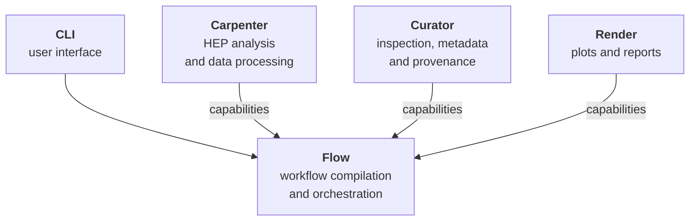

FAST-HEP is developed as a collection of focused packages.

Most users do not need to install or interact with these packages individually. The [`fasthep`](https://github.com/FAST-HEP/fasthep) meta package provides curated installations that bring together the components needed for common use cases.

The package split becomes useful when you want to understand where a capability comes from, use a component independently, or extend FAST-HEP with your own implementations.

---

## Toolkit overview

The main packages have distinct responsibilities:



Flow provides the orchestration layer. Carpenter, Curator, Render, and external packages provide capabilities that Flow can compose and execute.

This is not a closed set: experiments, projects, and individual analyses can provide capabilities through the same interfaces.

---

## Core toolkit

### `fasthep-flow`

**Flow** is the workflow engine.

It provides the general infrastructure for:

* authoring and compiling workflows
* constructing execution plans
* orchestrating operations
* profiles and registries
* execution environments

Flow is designed to remain largely domain-independent. HEP-specific analysis functionality is provided by other packages rather than built into the workflow engine.

[Documentation](https://fasthep-flow.readthedocs.io/en/latest/) · [GitHub](https://github.com/FAST-HEP/fasthep-flow)

---

### `fasthep-carpenter`

**Carpenter** provides common HEP data-processing and analysis capabilities.

These include:

* ROOT and Awkward Array data handling
* derived quantities and selections
* histogramming and cutflows
* common HEP operations
* data writers
* specialised execution capabilities

Carpenter provides these capabilities to Flow through registries and operation contracts, allowing them to evolve independently of the workflow engine.

[Documentation](https://fasthep-carpenter.readthedocs.io/en/latest/) · [GitHub](https://github.com/FAST-HEP/fasthep-carpenter)

---

### `fasthep-curator`

**Curator** provides inspection, metadata, provenance, and diagnostic capabilities.

These include:

* dataset and schema inspection
* provenance collection
* runtime diagnostics
* validation and reporting

Curator focuses on understanding and recording what happens around an analysis without owning its scientific transformations.

[Documentation](https://fasthep-curator.readthedocs.io/en/latest/) · [GitHub](https://github.com/FAST-HEP/fasthep-curator)

---

### `fasthep-render`

**Render** provides visualisation and reporting capabilities.

These include:

* scientific plots
* tables and reports
* reusable rendering styles
* publication-oriented outputs

Rendering is kept separate from the analysis operations that produce the underlying scientific products.

[Documentation](https://fasthep-render.readthedocs.io/en/latest/) · [GitHub](https://github.com/FAST-HEP/fasthep-render)

---

### `fasthep-cli`

**CLI** provides the user-facing `fasthep` command.

For example:

```bash
fasthep run author.yaml
```

The CLI provides a common interface to functionality owned by the other FAST-HEP packages rather than implementing workflow or analysis behaviour itself.

[Documentation](https://fasthep-cli.readthedocs.io/en/latest/) · [GitHub](https://github.com/FAST-HEP/fasthep-cli)

---

## Installation and supporting packages

### `fasthep`

The [`fasthep`](https://github.com/FAST-HEP/fasthep) meta package is the recommended installation entry point.

For a typical HEP environment:

```bash
pip install "fasthep[hep]"
```

It provides curated combinations of FAST-HEP packages so users do not need to manage the toolkit components individually.

---

### `fasthep-toolbench`

[`fasthep-toolbench`](https://github.com/FAST-HEP/fasthep-toolbench) contains small shared utilities used across the toolkit, including download, package-discovery, and terminal helpers.

Most users will encounter Toolbench indirectly through other FAST-HEP packages.

---

## Examples and development

### `fasthep-workshop`

[`fasthep-workshop`](https://github.com/FAST-HEP/fasthep-workshop) contains the runnable examples and tutorials used throughout the FAST-HEP documentation and training material.

It also demonstrates how analysis repositories can provide their own workflows, profiles, operations, and supporting code.

[Workshop documentation](https://fasthep-workshop.readthedocs.io/en/latest/) · [GitHub](https://github.com/FAST-HEP/fasthep-workshop)

---

### `fasthep-dev`

[`fasthep-dev`](https://github.com/FAST-HEP/fasthep-dev) is the integration workspace used when developing multiple FAST-HEP packages together.

It provides a common environment for cross-package development, integration testing, and coordinated ecosystem validation.

Most FAST-HEP users do not need `fasthep-dev`.

---

## Which package should I use?

For most users, the answer is simply **FAST-HEP as a whole**: install the `fasthep` meta package and use the `fasthep` command-line interface.

Individual packages become relevant when you want to go deeper:

| If you want to...                                 | Start with          |
| ------------------------------------------------- | ------------------- |
| describe, compile, or orchestrate workflows       | `fasthep-flow`      |
| process HEP data or add analysis operations       | `fasthep-carpenter` |
| inspect data or work with metadata and provenance | `fasthep-curator`   |
| create plots and reports                          | `fasthep-render`    |
| understand or extend the command-line interface   | `fasthep-cli`       |
| learn FAST-HEP through runnable examples          | `fasthep-workshop`  |
| develop several FAST-HEP packages together        | `fasthep-dev`       |

FAST-HEP packages use the same extension mechanisms available to experiment and analysis packages. The toolkit is therefore a collection of useful implementations built around Flow rather than a fixed set of capabilities built into it.

For more about this architecture, see [Profiles and registries]() and [Analysis repositories]().
